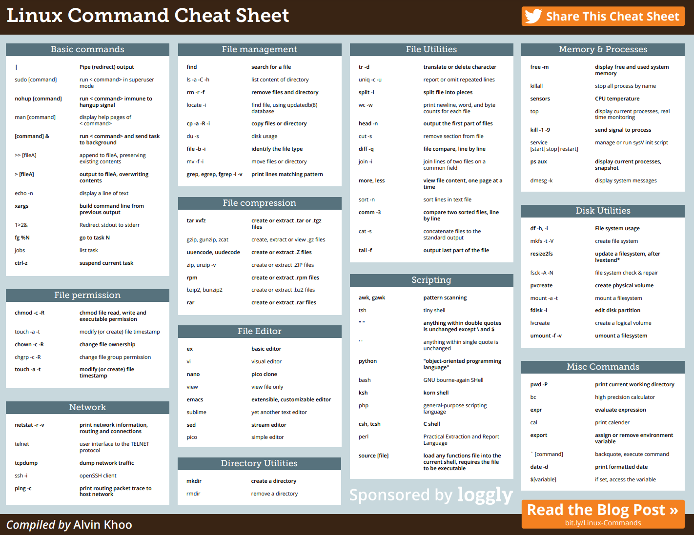
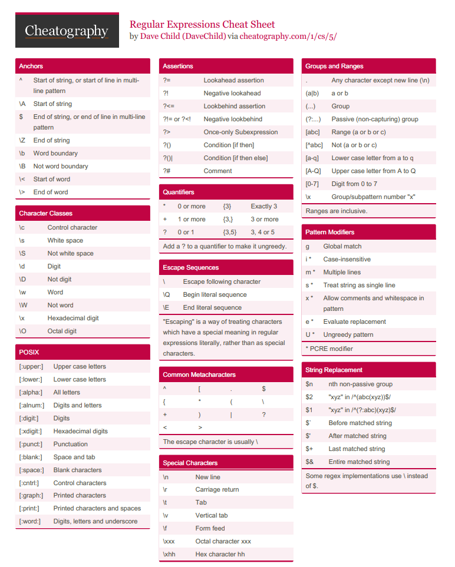

# KIK-LG221 Command-Line Tools for Linguists

The course served as a practical, compact introduction to the command-line environment (not only for linguists but also for everyone interested in learning how to use the command-line). An overview of what we learned during the course can be found below:

| **Week 1**  |  Introduction to Command Line Environments  |
| **Week 2**  |  Navigating a UNIX System                   |
| **Week 3**  |  Basic Corpus Processing                    |
| **Week 4**  |  Advanced Corpus Processing                 |
| **Week 5**  |  Scripting and Configuration Files          |
| **Week 6**  |  Installing and Running Programs            |
| **Week 7**  |  Version Control                            | 

Here is a Command Line Cheat Sheet that we were provided:

## Week 1: Introduction to Command Line Environments

The first week was about command-line basics. We learned how to set up the command-line and how to launch it. We also learned how to use some basic commands. For example, `ls` will list the contents of the current directory. We tried fetching contents from the internet to our home directory and also learned to view text files, create directories  and rename and move files. For example, `mv pg4511.txt life_of_bee.txt` will rename a file `pg4511.txt` into `life_of_bee.txt`. Moreover, we revised the concepts of a file and a text file and learned how to use a terminal-based text editor nano to view and edit text files.

The first week was quite straightforward and did not cause any problems. The material was easy to follow. 

## Week 2: Navigating a UNIX System

This week we delved deeper and got to know the UNIX system better. We learned how to copy, move, rename and delete directories and became acquainted with the standard system directories.For example, `rm -R some_directory` will remove `some_directory` even if it's not empty. Besides that, we learned about the security model used by UNIX systems and file permissions. We also examined UNIX process management. Moreover, we learned how to set up a remote server access and remotely execute commands using the programs ssh and scp.

This week everything went smoothly, except the things that went wrong :) I had problems connecting to Puhti on my laptop and couldn't complete two questions of the quiz before the deadline. Otherwise a very enjoyable week.

## Week 3: Basic Corpus Processing

We dealt with processing tools in UNIX in the third week of the course. We touched upon character encodings and converting between different character encodings. We also learned commands used in processing text files and searching in text files. We became acquainted with simple regular expressions and practiced matching strings with specific patterns. We also tried using the command egrep to search for lines in text files. Finally, we became acquainted with formatted text files such as csv files and tsv files and UNIX commands for manipulating such files.

Below is a list of some important commands that we learned in the third week:

* `file`: recognizes the type of data contained in a file

* `dos2unix`: converts the encoding of characters

* `iconv`: converts Windows end of lines to Unix end of lines

* `head`: displays the first few lines of a file

* `tail`: displays the last few lines of a file

* `tr`: repleces characters

* `sort`: sorts a file

* `uniq`: removes repeated lines in a file

* `cut`: extracts sections from each line of input data

* `egrep`: searches for lines in a text file

* `wc`: displays the number of lines, words and bytes contained in a file 

## Week 4: Advanced Corpus Processing

The forth week was quite heavy. We continued working with text processing commands and learned how to use command pipelines. Moreover, we practiced using the powerful stream editor command `sed` and deepened our understanding of regular expressions. More specifically, we learned how to transform a text file into a frequency list or into one sentence per line format an how to generate a list of word n-grams for a text file

In my opinion, the fourth week was the most challenging and time-consuming but at the same time very rewarding in terms of learning.

Below is a useful Regular Expressions Cheat Sheet created by Dave Child:

## Week 5: Scripting and Configuration Files

This week we learned the basics of scripting and practiced writing simple scripts. We learned how to use the if statement and got acquainted with bash variables and command substitution. We also learned what the UNIX environment variables are, how to edit them and what this editing does. Moreover, we discovered how we can use the bash configuration files to make  the environment variable changes permanent.

## Week 6: Installing and Running Programs

In the sixth week  we learned how to become the root user and got acquainted with the differences between su and sudo. Moreover, we learned about package managers, software libraries and software dependencies, and practiced installing programs. Furthermore, we learned how to create a python virtual environment , install python packages and manage different python installations. Last but not least, we discovered what make is, how it works, and practiced writing Makefiles.

## Week 7: Version Control

In the seventh week we learned about the power of version control, a version control system called Git and a developer platform called GitHub. We learned how to create a repository on Github and clone this repository in a local computer. Furthermore, we practiced adding files to the local repository, committing changes and pushing the changes to a global Git repository. We also learned how to create Git branches, switch between them and how to merge a Git branch to master.

## Final assignment
We learned how to build a website and how to publish it on GitHub pages. We practiced creating a CV on Overleaf and also tried out using a site generator Jekyll. Moreover, we learned the basics of writing and formatting syntax using Markdown.

## Conclusion

I had very limited knowledge of UNIX prior to this course and my main goal was to learn the fundamentals of command-line. I definitely achieved my goal as I have learned so much! The course was very worthwhile, well planned, and laid out in a clever way. All exercises were fun and beneficial to the entire learning process, at times demanding, but certainly manageable. Thank you so much for the great course!
