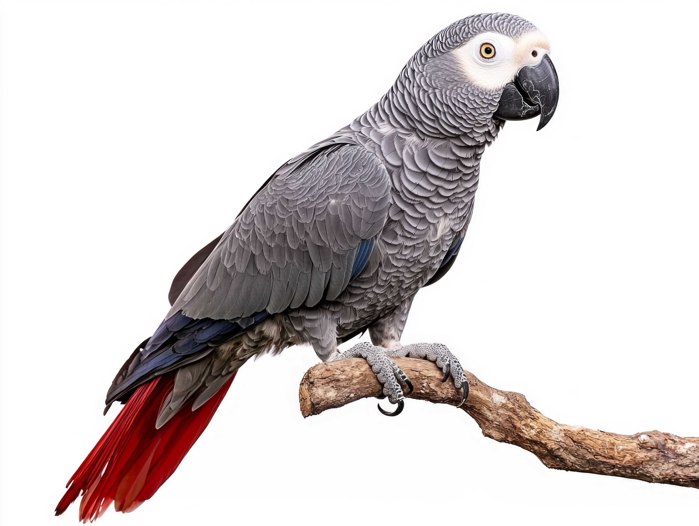

## Introduction

 Hey, so glad to see you!

The handsome little fellow in the picture is an African grey parrot, a highly intelligent animal known for its cognitive and communicative abilities. Studies have shown that grey parrots can memorize sequences of numbers and may comprehend the mathematical concept of zero. Moreover, they are capable of learning colors and identifying objects, materials and shapes. Research suggests that grey parrots are capable of not only mimicking sounds but also learning words and phrases, which they often speak in correct context.

## The creator of this website can be found on

[GitHub](https://github.com/kristina-pr)

## Contact

My email address is of the form first_name.last_name@helsinki.fi. 

## Courses I've Taken

[Enjoying Cheese I](https://courses.helsinki.fi/enjoying-cheese-I), fall 2018

[Feline Avoidance](https://courses.helsinki.fi/feline-avoidance), fall 2018

## Projects

## Misc. 

[Gotta Love Cheese](https://en.wikipedia.org/wiki/Cheese) 
